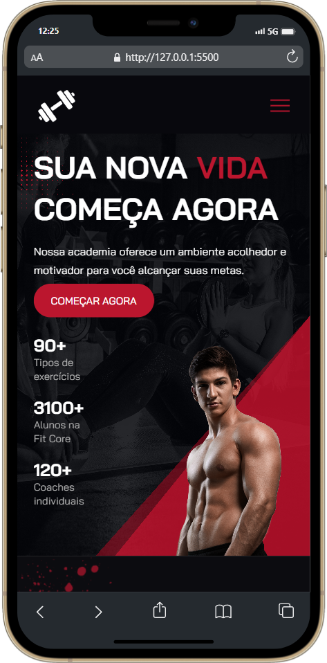
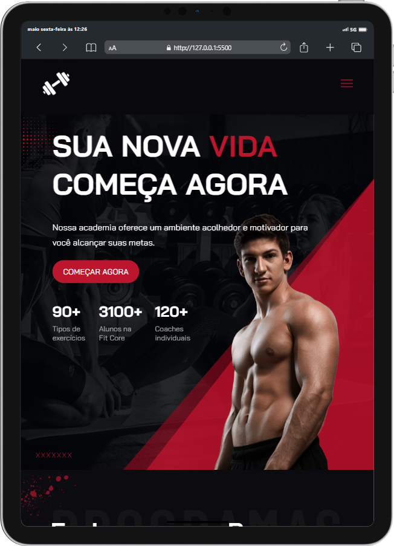

<h1 align="center">

</h1>
 

<h3 align="center">
💪🏼 Preview - Desktop
</h3>

 
 

<h3 align="center">
💪🏼 Preview - Mobile e Tablet
</h3>
 

&ensp; &ensp; &ensp; &ensp; &ensp; &ensp; &ensp; &ensp; &ensp; &ensp; &ensp; &ensp; &ensp; &ensp; &ensp;  &ensp; &ensp; &ensp; 
 
 

## 🏋🏻‍♀️ Sobre

> É um projeto de uma landing page de uma academia que desenvolvi para um teste empresarial. A obrigatoriedade era que tivesse um carrossel com posts fictícios do instagram, e que esses posts acompanhassem a identidade visual da página.
 

## 💮 Seções
O site é composto por seis partes:

- **Home:** Nessa parte é uma breve apresentação da academia;
- **Programas:** Mostra alguns programas de treino que a academia possui;
- **Planos:** Mostra os planos disponíveis para o cliente;
- **App:** É onde instiga o usuário a fazer o download do aplicativo para celular;
- **Dicas:** É o carrossel de posts do instagram, onde tem dicas para o cliente.;
- **Informações:** Apresenta algumas informações sobre a empresa e um formulário para recebimento da newsletter;
 

---

## 💻 Tecnologias utilizadas:

Para o desenvolvimento deste site utilizei as seguintes tecnologias:

* HTML
* Sass
* JavaScript
* ScrollReveal
* Figma

---

## 🎐 Licença
Esse projeto está sob licença. Clique no arquivo [LICENÇA](https://github.com/larisn/larisn/blob/main/LICENSE.md) para ver mais detalhes.

 

---

Feito com ❤️ by larisn
